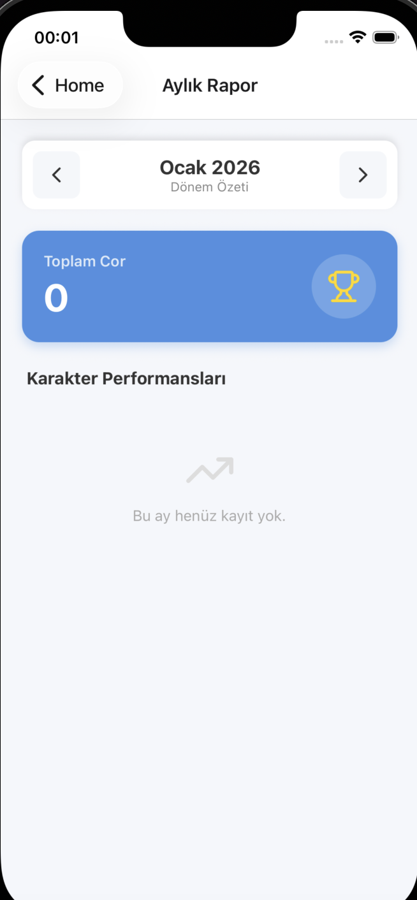

# 💎 Metin2 Daily Tracker (Cor & Guild)

Metin2 oyuncularının en büyük derdi olan "Bugün hangi çarla Cor yaptım?", "Lonca bağışını unuttum mu?" sorularını bitiren; **React Native** ve **TypeScript** ile geliştirilmiş kişisel takip asistanı.

  

## 📱 Proje Hakkında

Bu uygulama, birden fazla karakteri yöneten oyuncuların günlük rutinlerini (Cor Draconis görevleri ve Lonca bağışları) takip etmelerini ve aylık performanslarını analiz etmelerini sağlar. Veriler yerel depolamada (Local Storage) tutulur, internet bağlantısı gerektirmez.

## ✨ Özellikler

* **👥 Karakter Yönetimi:** Sınırsız sayıda oyun karakteri ekleme ve silme.
* **✅ Günlük Takip (Daily Check):**
    * Her karakter için "Cor" ve "Lonca" durumu işaretleme.
    * Geçmiş günlere dönük veri girişi ve düzenleme.
    * Gelecek günlere veri girişini engelleyen tarih kontrolü.
* **📊 Aylık İstatistikler (Monthly Report):**
    * Seçilen ayın toplam Cor sayısı.
    * Karakter bazlı performans sıralaması (Leaderboard).
    * Görsel ilerleme çubukları.
* **🎨 UI/UX:**
    * `SafeArea` uyumlu, çentik (notch) dostu tasarım.
    * Özel Header ve Navigasyon yapısı.
    * Responsive kart tasarımları.

## 🛠️ Kullanılan Teknolojiler

* **Core:** React Native (Expo SDK 50+)
* **Dil:** TypeScript
* **Navigasyon:** React Navigation (Stack)
* **Veri Saklama:** @react-native-async-storage/async-storage
* **İkonlar:** Lucide React Native
* **Platform:** iOS & Android

## 📸 Ekran Görüntüleri

| Ana Sayfa | Günlük Takip | Aylık Rapor |
|:---:|:---:|:---:|
|  |  |  |

*(Not: Ekran görüntüleri temsilidir, kendi aldığın SS'leri buraya ekleyebilirsin.)*

## 🚀 Kurulum

Projeyi yerel makinenizde çalıştırmak için aşağıdaki adımları izleyin:

1. **Repoyu klonlayın:**
   ```bash
   git clone [https://github.com/kullaniciadi/metin2-daily-tracker.git](https://github.com/kullaniciadi/metin2-daily-tracker.git)
   cd metin2-daily-tracker
``
2. **Bağımlılıkları yükleyin:**
  ```bash
  npm install veya yarn install```
3. **Uygulamayı başlatın:**
  ```bash
npx expo start```
4. **iOS (Xcode) için Native Build (Opsiyonel):**
```bash
npx expo prebuild
xed ios```
## 📂 Proje Yapısı
  metin2-daily-tracker/
  ├── assets/                 # İkonlar ve görseller
  ├── components/             # Tekrar kullanılabilir bileşenler (CustomScreenWrapper vb.)
  ├── screens/                # Uygulama ekranları
  │   ├── HomeScreen.tsx      # Karakter listesi ve ekleme
  │   ├── DailyCheck.tsx      # Günlük işaretleme ekranı
  │   └── MonthlyStats.tsx    # İstatistik ekranı
  ├── navigation/             # Navigasyon ayarları
  ├── App.tsx                 # Ana giriş dosyası
  └── README.md

## 🤝 Katkıda Bulunma
Bu proje kişisel kullanım için geliştirilmiştir ancak geliştirmelere açıktır. Pull request göndermekten çekinmeyin!

Developed with ❤️ by [Senin Adın]
